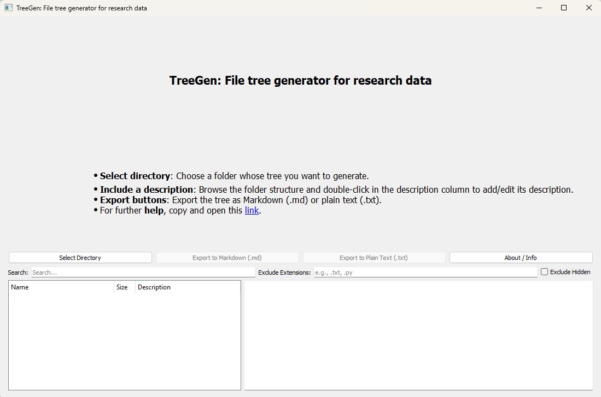

# TreeGen: Quick Start Tutorial

Welcome to **TreeGen**, a desktop application that helps you document your file and folder structures in a readable and shareable format. This tutorial will walk you through installing, using, and exporting your first file tree.

***
## 1. Installation

### Option A: Use the Executable

If you downloaded the standalone executable for your system (Windows `.exe` or macOS `.app`), simply double-click the file to launch TreeGen.

### Option B: Run with Python (for advanced users)

#### Requirements:

* Python 3.10+
* Conda or virtual environment (recommended)

#### Step 1: Clone the repository

```
git clone https://github.com/Alliance-RDM-GDR/RDM_FileTree.git
cd RDM_FileTree
```

#### Step 2: Create and activate environment

```
conda env create -f environment.yml
conda activate treegen-env
```

#### Step 3: Run the app

```
python TreeGen.py
```


#### Step 4: Compile the app (optional)

To compile the app into a single executable file for Windows or Mac, open a terminal window in the app folder and enter the following command:

For windows and MAC:

```bash
pyinstaller --onefile --windowed TreeGen.py
```

## 2. User Interface Overview

TreeGen has a clean, split-pane interface:

* **Left Pane:** Displays the folder and file structure. You can expand directories and double-click to edit descriptions.
* **Right Pane:** Shows a live Markdown preview of the entire tree.
* **Top Controls:** Buttons to select a folder, export the tree to Markdown or text, and access help.
* **Filter Bar:** Lets you search for filenames and exclude file types or hidden items.

---

{fig-alt="An image showing the graphic interface of the file tree generator." fig-align="center"}

## 3. Creating a File Tree

### Step 1: Select a Directory

Click the **"Select Directory"** button and browse to the folder you want to document.

### Step 2: Explore and Annotate

* Click to expand folders.
* Double-click any row to add a description to that file or folder.
* Use the search box to filter files.
* Optionally, exclude file types (e.g., `.log, .pyc`) or hidden files.

### Step 3: Preview the Output

As you annotate and navigate, the Markdown preview updates live on the right.

---

## 4. Exporting Your Tree

When you're ready, click:

* **"Export to Markdown (.md)"** to save a clean, structured Markdown version.
* **"Export to Plain Text (.txt)"** for simpler inclusion in email or documents.

Your exported file will include:

* Tree hierarchy with size info
* Folder names in bold (Markdown)
* Any added descriptions as HTML comments
* Summary at the end (total files, folders, size)

---

## 5. Tips

* TreeGen stores your descriptions in a hidden `.descriptions.json` file in the selected folder.
* Clicking the **About / Info** button provides information and links.
* A clickable help link is embedded in the instructions shown on startup.

---

## 6. Support and Citation

For help, visit the [README](https://github.com/Alliance-RDM-GDR/RDM_FileTree) or contact us at [rdm-gdr@alliancecan.ca](mailto:rdm-gdr@alliancecan.ca).

To cite TreeGen, please refer to the `CITATION.cff` file in the repository or cite the corresponding DOI via Zenodo.

---

*Digital Research Alliance of Canada*

